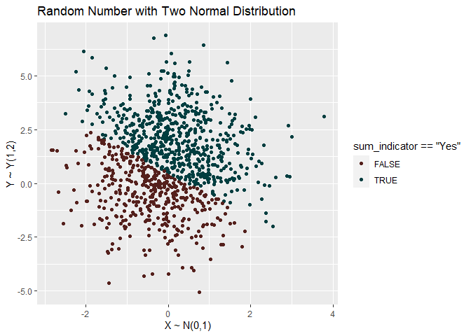

Homework 1
================
Haolin Wu
Feb 03rd, 2022

------------------------------------------------------------------------

``` r
set.seed(7462)
library(tidyverse)
```

    ## -- Attaching packages --------------------------------------- tidyverse 1.3.1 --

    ## v ggplot2 3.3.5     v purrr   0.3.4
    ## v tibble  3.1.6     v dplyr   1.0.7
    ## v tidyr   1.1.4     v stringr 1.4.0
    ## v readr   2.1.1     v forcats 0.5.1

    ## -- Conflicts ------------------------------------------ tidyverse_conflicts() --
    ## x dplyr::filter() masks stats::filter()
    ## x dplyr::lag()    masks stats::lag()

``` r
library(forcats)
random_number <- tibble(
  x = rnorm(1000,0,1), 
  y = rnorm(1000,1,2),
  sum_indicator = x+y > 0.5 
)

random_number <- random_number%>%
  mutate(sum_indicator = factor(sum_indicator),
         sum_indicator = fct_recode(sum_indicator,
                                    'Yes' = 'TRUE',
                                    'No' = 'FALSE'),
         sum_indicator = sum_indicator %>% fct_relevel("Yes"))

random_number %>%
  ggplot(aes(y=y, x=x, col = sum_indicator == "Yes"))+geom_point() +
  xlab("X ~ N(0,1)")+
  ylab("Y ~ Y(1,2)")+
  ggtitle('Random Number with Two Normal Distribution')+
  scale_color_hue(l=20, c=35)+
  labs(fill = "x_y > 0.5")
```

<!-- --> \`\`\`
